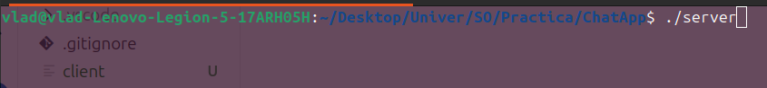
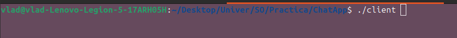
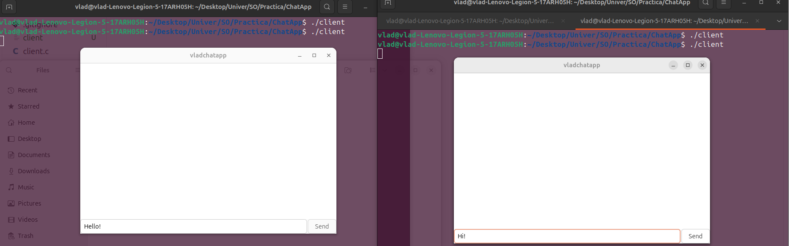
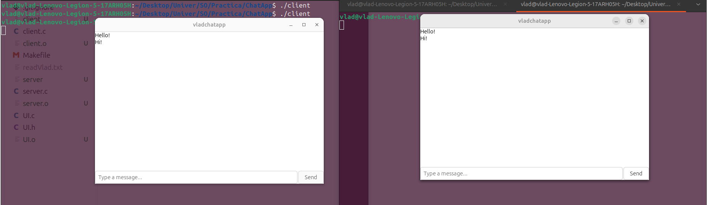

My chat app is a simple chat application simulation built in **C**, using **TCP sockets** and **I/O multiplexing** with `select()`. The project includes a **server** program and a **client** program with a **GTK-based UI**. 

This project was made for fun and practice.

---

### **Features:**
- Group chat simulation with server + multiple clients
- UI built using GTK
- I/O multiplexing (`select`) for handling multiple connections
- Fully written in C 🧠
### **Technologies Used**
 - C (GCC)
- TCP/IP sockets
- `select()` for multiplexing
- GTK (Gtk4 )
- Linux environment

### **Images**

### Starting the Server

### Launching the Client

### Chat Interface

### **Dependencies and Build:**
Your system must have:
	GTK 4
	Standard Linux build tools (`gcc`, `make`, `pkg-config`)

You can install the packages in Ubuntu/Debian:
	sudo apt update
	sudo apt install build-essential pkg-config libgtk-4-dev

After installing GTK-4 and cloning the repository simply run  `make` in a terminal and the you'll get the executables(server and client).
1)Start the server in a terminal:
`./server`
2) Open one or more new terminals and start clients:
`./client`
Each client will connect to the server and participate in the shared chat, allowing you to simulate group messaging🎈.

